# Università Ca' Foscari - Progetto C

## PROGRAMMAZIONE E LABORATORIO [CT0442] - Proff. A. Marin e S. Vascon

  
  
  
  
  

# Image Processing Library (v.1.0)
### Scopo:
Realizzare una libreria in linguaggio C per effettuare operazioni di elaborazione di immagini
(image processing).
Il progetto è diviso in tre parti (consegnate in un’unica soluzione):
<ul>
<li>la prima parte in cui dovrete implementare un insieme di metodi per la gestione di matrici a 3 dimensioni, comprendente alcune operazioni matematiche e di gestione della memoria.</li>
<li>nella seconda parte dovrete implementare alcuni semplici metodi per l’elaborazione di immagini (conversione da colore a scala di grigi, corruzione di immagini etc…).</li>
<li>nell’ultima parte vi verrà richiesto di implementare l’algoritmo di convoluzione a cui applicherete filtri per ottenere interessanti effetti.</li>
</ul>
Per ottenere il massimo punteggio nel laboratorio dovrete implementare correttamente tutti i metodi presenti nel file ip_lib.h
 

## Introduzione al progetto
### Le immagini e il computer
Le immagini sono codificate nel computer tramite griglie ordinate di pixel. Un pixel è l’entità più piccola per descrivere il colore di un’immagine in un determinato punto. 
I pixel di un’immagine tipicamente hanno valori compresi tra 0 e 255, pertanto saranno necessari 8 bit per rappresentare un pixel. 
Le immagini sono rappresentate in memoria tramite matrici (l’ordine dei pixel è fondamentale). Nel caso di immagini in scala di grigi abbiamo solo un canale (il canale di luminosità).
 
 

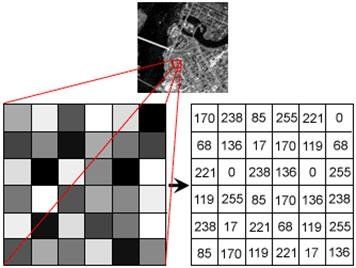

 
 
Nel caso di immagini a colori (il nostro caso), per rappresentare i colori visibili vengono utilizzati 3 canali (rosso, verde e blu). Ogni pixel quindi è composto da 3 valori (rosso, verde e blu). Pertanto la matrice avrà tre dimensioni: larghezza x altezza x 3. Tipicamente si parla di immagini a 24 bit (8 bit * 3 canali = 24 bit).
 
 

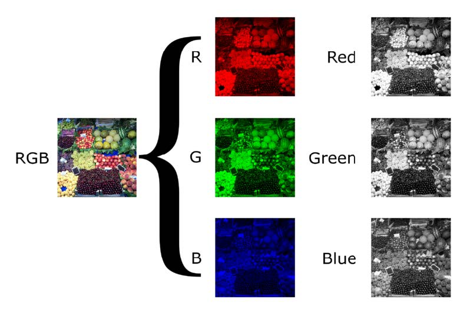

 
 
La libreria in C per leggere e scrivere immagini in formato BITMAP vi viene fornita nello zip del progetto e contiene un riadattamento di quella disponibile a questo indirizzo: https://github.com/wernsey/bitmap 
Trovate maggiori dettagli sulla libreria a questa pagina http://wstoop.co.za/bitmap.php  
Per il primo passo vi serviranno i file: test_bmp.c, bmp.c e bmp.h  
Compilate bmp.c creando un file oggetto bmp.o che userete successivamente. In questo caso potete compilare solo col parametro -Wall.  
Per testare che tutto funzioni, compilate il file test_bmp.c che trovate nello zip del progetto linkando la libreria bmp.o ed eseguite il file.  
Al termine dell’esecuzione dovreste ottenere un file bitmap (che potete aprire con un qualsiasi visualizzatore di immagini) chiamato “mandelbrot.bmp” contenente una delle immagini frattali più famose al mondo (se siete curiosi... https://it.wikipedia.org/wiki/Frattale ).
 
 

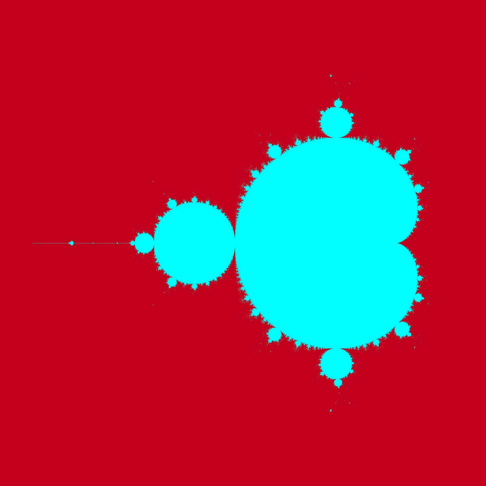

 
 
Bene, siete riusciti a creare delle immagini col vostro PC! (altrimenti bussate sul forum in Moodle). 
Attenzione: Nella libreria bmp.h sono presenti svariati metodi, quelli che potete usare sono: 
<ul>
<li>bm_create(...) crea una variabile di tipo Bitmap specificando larghezza (width) e altezza (height)</li>
<li>bm_load(...) Carica un’immagine salvata in formato bitmap su una variabile di tipo Bitmap.</li>
<li>bm_save(...) salva una variabile di tipo Bitmap su file. Bisogna specificare il nome del file.bmp.</li>
<li>bm_free(...) libera la memoria allocata dalla variabile Bitmap.</li>
</ul>
…gli altri sono proibiti, ma li lascio per vostra curiosità.

# Il progetto
## Image Processing 
L’image processing, o elaborazione delle immagini, è una branca della computer science nata negli anni ‘60 con il fine di applicare delle trasformazioni alle immagini più o meno in modo automatico. Applicazioni tipiche sono la rimozione del rumore, l’equalizzazione, la conversione di formati, scalatura, ritaglio o il rilevamento di bordi. In sostanza le operazioni basilari che trovate all’interno di Photoshop o GIMP. 

### PARTE 1: strutture dati, operazioni matematiche e gestione memoria
Per le operazioni successive dobbiamo realizzare una nuovo tipo di dato chiamato ip_mat (image processing matrix). Il tipo ip_mat altro non è che una matrice a 3 dimensioni (altezza x larghezza x canali, vedi figura sotto) in cui saranno memorizzati i pixel dell’immagine e sui quali applicheremo varie trasformazioni. Nella conversione da Bitmap a ip_mat, ai pixel viene fatto un casting a float in quanto le operazioni di elaborazione avranno bisogno di lavorare con dati in virgola, positivi e negativi. Dovremo quindi abbandonare i pixel [0,255] per un po’. 
 
 

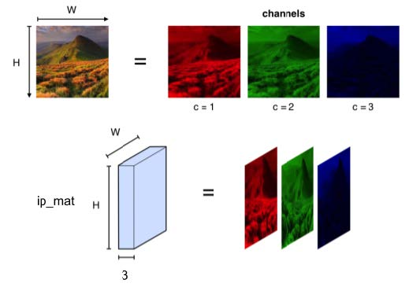

 
 
Ci appoggeremo alla seguente struttura che dovrete implementare:
 
<pre>
typedef struct {
    unsigned int w; /* <- larghezza */
    unsigned int h; /* <- altezza */
    unsigned int k; /* <- canali (3 nel nostro caso)*/
    stats * stat;   /* <- statistiche per canale. */
    float *** data; /* <- matrice 3D di valori */
}ip_mat;
</pre>
 
La matrice a tre dimensioni sarà memorizzata nella variabile data. 
 
Vi viene lasciata libertà sulla struttura di memoria (la variabile data della struttura di cui sopra). Per praticità vi consiglio di utilizzare gli indici frastagliati, però se preferite linearizzare la matrice 3D fate pure (ricordatevi di modificare anche i metodi set_val e get_val).

<u>IMPORTANTE: La matrice data avrà dimensioni h x w x k.</u>

 
Abbiamo inoltre un tipo di dato stats:
 
<pre>
typedef struct{
    float min;
    float max;
    float mean;
}stats;
</pre>
 
che conterrà alcune statistiche (min, max, mean) sui diversi canali dell’immagine. In sostanza la variabile stat in ip_mat sarà un puntatore ad un vettore di stats di lunghezza k. 
 
Dovrete implementare i seguenti metodi (per i dettagli vedete il file ip_lib.h): 
<pre>
ip_mat * ip_mat_create(unsigned int h, unsigned int w, unsigned int k, float v);
void ip_mat_free(ip_mat *a);
float get_val(ip_mat * a, unsigned int i,unsigned int j,unsigned int k);
void set_val(ip_mat * a, unsigned int i,unsigned int j,unsigned int k,  float v);
void ip_mat_init_random(ip_mat * t, float mean, float var);
ip_mat * ip_mat_copy(ip_mat * in);
ip_mat * ip_mat_concat(ip_mat * a, ip_mat * b, int dimensione);
ip_mat * ip_mat_subset(ip_mat * t, unsigned int row_start, unsigned int row_end, unsigned int col_start, unsigned int col_end);
</pre>
 
alcune operazioni matematiche tra tipi ip_mat: 
<pre>
ip_mat * ip_mat_sum(ip_mat * a, ip_mat * b);
ip_mat * ip_mat_sub(ip_mat * a, ip_mat * b);
ip_mat * ip_mat_mul_scalar(ip_mat *a, float c);
ip_mat * ip_mat_add_scalar(ip_mat *a, float c);
ip_mat * ip_mat_mean(ip_mat * a, ip_mat * b);
void compute_stats(ip_mat * t);
</pre>
 
Trovate invece <u>già implementati</u> i seguenti metodi: 
<ul>
<li>Convertire un'immagine da mappa di pixel ad ip_mat e viceversa: 
<pre>
ip_mat * bitmap_to_ip_mat(Bitmap * img);
Bitmap * ip_mat_to_bitmap(ip_mat * t);
</pre></li>

<li>generazione di numeri da una distribuzione normale: 
<pre>
float get_normal_random();
</pre></li>

<li>visualizzazione di tipi ip_mat: 
<pre>
void ip_mat_show_stats(ip_mat * t);
void ip_mat_show(ip_mat * t);
</pre></li>
</ul>

### PARTE 2: Operazioni semplici con immagini
Dovrete implementare i seguenti metodi (maggiori dettagli in ip_lib.h): 
 
Ricordatevi che per visualizzare il dato ip_mat dovete convertirlo in bitmap
( ip_mat_to_bitmap(ip_mat * t)); e salvarlo come immagine (bm_save(...)); 
 
Image Brightening: 
Aumenta il valore di tutti i pixel di una costante bright. L’effetto è alzare la luminosità complessiva dell’immagine. 
<pre>ip_mat * ip_mat_brighten(ip_mat * a, float bright)</pre>
 
 

 
 
Conversione a scala di grigi: 
<pre>ip_mat * ip_mat_to_gray_scale(ip_mat * in); 
Converte un’immagine a colori in una a scala di grigi:
 
 

 
 
Aggiunta di rumore: 
<pre>ip_mat * ip_mat_corrupt(ip_mat * in, float amount);</pre> 
Aggiunge del rumore Gaussiano all’immagine, il parametro amount determina la quantità di rumore inserito.
 
 

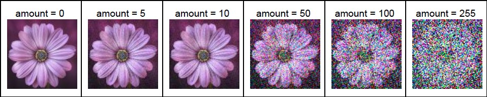

 
 
Image Blending: 
<pre>ip_mat * ip_mat_blend(ip_mat * a, ip_mat * b, float alpha);</pre> 
Fonde due immagini insieme tramite combinazione convessa. 
Blend = alpha * A + (1-alpha)* B;
 
 

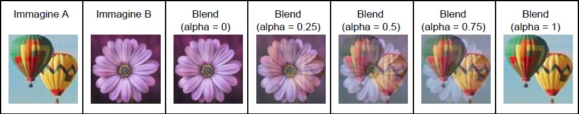

 
 

### PARTE 3: Convoluzione e filtraggio
La convoluzione è una delle tecniche di analisi di segnali maggiormente applicate, ed è inoltre largamente applicata nel contesto di immagini. E’ uno dei metodi di processamento di immagini più semplici ma potenti e rappresenta uno dei fondamenti della visione artificiale, nell’analisi di segnali, nelle moderne reti di intelligenza artificiale e nelle reti profonde (deep learning). 
 
La convoluzione, non è altro che un media pesata dei valori dell’immagine rispetto a quelli di un filtro, chiamato kernel . Il kernel è una matrice di valori reali (tipicamente sono matrici quadrate a dimensioni dispari non molto grandi, come una 3x3 o 5x5) che definiscono “l’importanza” dei pixel sottostanti. In funzione della configurazione dei valori del filtro abbiamo diversi effetti sull’immagine di input. 
 
Il kernel abbiamo detto essere una matrice di float , possiamo quindi utilizzare la stessa struttura ip_mat anche per memorizzare il filtro. 
 
Come funziona al lato pratico? prendiamo ad esempio la figura qui sotto. Abbiamo un’immagine 5x5x1 e un filtro 3x3x1:
 
 

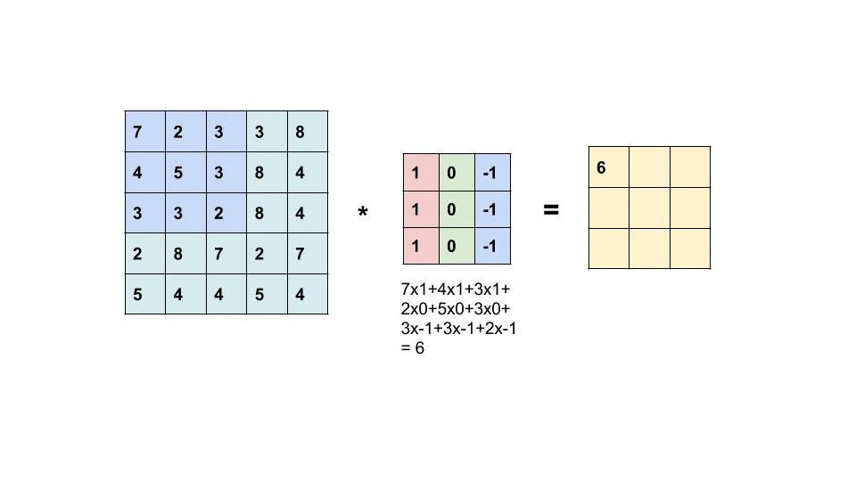

 
 
Fig 1: esempio di calcolo della convoluzione tra immagine (sinistra), filtro (centro). Il risultato è a destra. 
 
Sovrapponiamo il kernel all’immagine in alto a sinistra (prima posizione) e calcoliamo la convoluzione (somma dei prodotti):
 
 

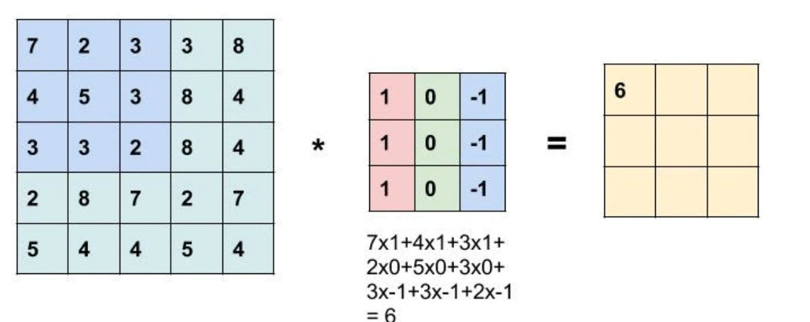

 
 
I valori dei pixel dell’immagine sotto il filtro sono:
 

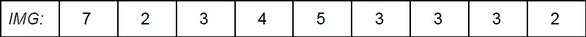

 
 
Quelli del filtro:
 

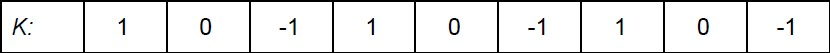

 
 
Il risultato della convoluzione è la somma dei prodotti, quindi: 
7*1 + 2*0 + 3*-1 + 4*1 + 5*0 + 3*-1 +3*1 +3*0+2*-1 = 6 
 
Questo sarà il valore del pixel in alto a sinistra nell’immagine risultante. La stessa operazione viene effettuata su tutta l’immagine (vedi animazione) facendo scorrere il filtro di una posizione alla volta su tutte le righe e colonne. 
 
Iniziamo ora la parte pratica: 
Dovete implementare l’operazione di convoluzione in questo metodo (vedete la descrizione in ip_lib.h):
<pre>ip_mat * ip_mat_convolve(ip_mat * input, ip_mat * filter);</pre> 
 
e implementare le soluzioni ai seguenti problemi: 
 
Problema 1: le immagini sono rappresentate tramite una matrice a 3 dimensioni ma il filtro è a 2 dimensioni. 
possiamo quindi: 1) avere filtri diversi per ogni canale (uno per il canale rosso, uno per il verde ed uno per il blu) oppure 2) utilizziamo lo stesso filtro per tutti i canali. 
 
A voi la scelta implementativa, considerate che in questo laboratorio non avremo un filtro diverso per canale, ma nel caso più generale si. 
 
Problema 2: Cosa fare sui bordi? 
Come potete notare, l’immagine risultante dalla convoluzione è più piccola dell’immagine originale perdendo l’informazione sui bordi. Ad esempio nella figura sopra otteniamo un’immagine con dimensione 3x3x1 (vedi parte destra della Figura 1). 
 
Ci sono varie tecniche per risolvere questo problema e ottenere un’immagine delle dimensioni originali dopo la convoluzione. Nel nostro caso useremo una tecnica chiamata padding. Nel padding si estende l’immagine con un bordo di pixel tutti a zero in modo tale da ottenere un’immagine della stessa dimensione dell’input a convoluzione applicata.
 
 

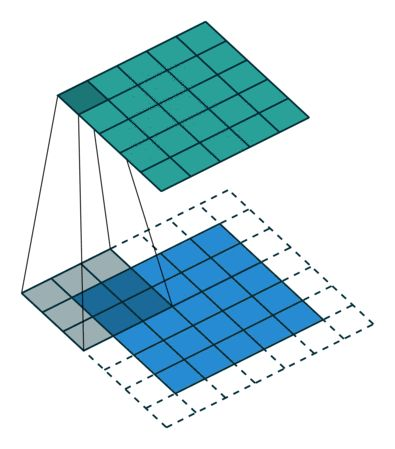

 
 
Nella figura sopra abbiamo: in blu l’immagine (a singolo canale), in bianco il padding, in grigio il filtro e in verde l’immagine risultante. Notate come la dimensione dell’immagine verde sia la medesima dell’immagine blu. 
 
Ma quanto bordo aggiungere? Dipende dalle dimensioni del filtro! 
 
In generale il padding si calcola come: 
P = (F-1)/2 mantenendo la parte intera. Dove P è il valore del padding risultante ed F è la dimensione del filtro. 
 
Quindi un filtro 3x3 avrà come padding orizzontale (3-1)/2 = 1 e verticale (3-1)/2 = 1. Un filtro 5x5 avrà come padding orizzontale (5-1)/2 = 2 e verticale (5-1)/2 =2.
 
 

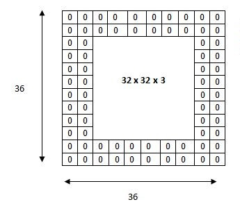

 
 
Se il filtro è di dimensione 3x3 estenderemo quindi l’immagine di 1 pixel per lato, ad esempio se un’immagine è a 283x362x3, l’immagine risultante con il padding sarà di 285*364x3 (1 pixel sul lato sinistro, 1 sul lato destro, 1 pixel in alto e 1 sotto). 
 
 

L’operazione di padding viene effettuata, ovviamente, prima della convoluzione.
 
 
Per realizzare le operazioni di padding dovrete implementare queste funzioni (vedete la descrizione in ip_lib.h):
<pre>ip_mat * ip_mat_padding(ip_mat * a, int pad_h, int pad_w);</pre> 
 
 
Problema 3: Che valori mettere nel kernel? 
Il kernel definisce che operazione stiamo facendo sull’immagine. In funzione del tipo di kernel potremo infatti ottenere risultati diversi come togliere il rumore da un’immagine o evidenziare i bordi oppure enfatizzare i dettagli. 
 
Potete trovare degli esempi a questo link: https://setosa.io/ev/image-kernels/
 
 

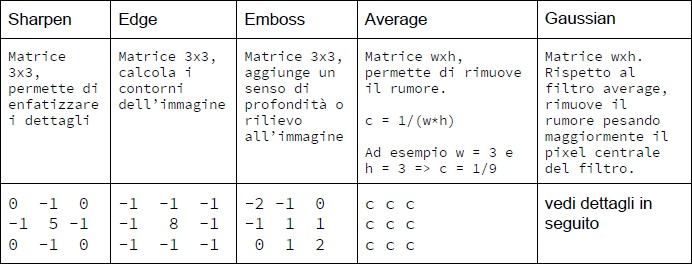

 
 
Dovete implementare i seguenti filtri (dettagli su ip_lib.h): 
<pre>ip_mat * create_sharpen_filter();</pre> 
<pre>ip_mat * create_edge_filter();</pre> 
<pre>ip_mat * create_emboss_filter();</pre> 
<pre>ip_mat * create_average_filter(int w, int h, int k);</pre> 
<pre>ip_mat * create_gaussian_filter(int w, int h, int k, float sigma);</pre> 
 
 
Risultati attesi con i vari kernel sul file flower.bmp:
 
 

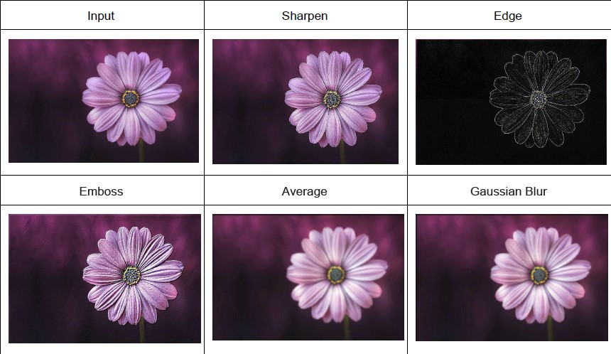

 
 
Filtro Gaussiano: 
Il filtro Gaussiano è simile al filtro medio (average), solo che i pixel hanno un peso diverso in funzione della distanza dal pixel centrale del kernel. Più un kernel è grande più i pixel alla periferia peseranno meno rispetto al pixel centrale. 
 
Per creare un filtro Gaussiano abbiamo bisogno di tre parametri h , w e σ: 
<ol>
<li>calcoliamo la cella centrale del filtro: troviamo quindi gli indici cx e cy (ad esempio in un kernel di dimensioni 7 x 7 la cella centrale avrà come indici cx = 3 e cy = 3).</li>
<li>Ora data una locazione (i, j) nel kernel ne calcoliamo la distanza dal centro: x = i - cx , y = j - cy</li>
<li>Il valore del kernel in posizione [i, j] sarà quindi 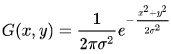</li>
<li>Una volta calcolati tutti i valori del kernel, normalizziamo il filtro dividendo per la sua somma. In questo modo la somma di tutti i pesi sarà unitaria.</li>
</ol> 
 
La forma della funzione che state modellando è la seguente, notate che al centro (0,0) il valore è alto mentre cala man mano che ci spostiamo verso le estremità (a 3σ i valori di G(x,y) sono praticamente nulli:
 
 

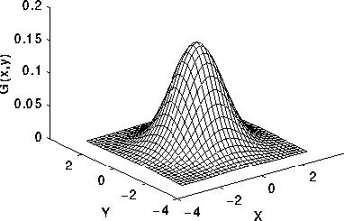

 
 

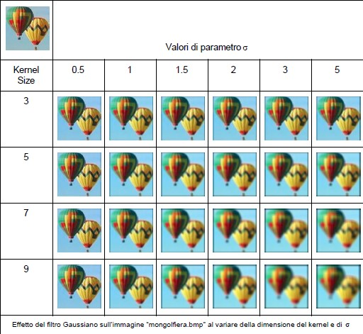

 
 
Come potete notare dalla tabella sopra, l’effetto maggiore viene dato dalla dimensione del kernel (prima colonna) che determina la finestra entro la quale viene fatta la media pesata dei pixel. Più è ampia la finestra maggiore sarà l’effetto di sfocatura. Il parametro σ invece determina l’effetto della vicinanza dei pixel rispetto al centro del kernel (che vi ricordo corrisponde al pixel calcolato durante la convoluzione) più è alto σminore sarà l’influenza della vicinanza rispetto al centro (si comporterà come un filtro medio). 
 
L’applicazione per la quale è nato il filtro gaussiano è la riduzione del rumore, di seguito un esempio dell’effetto su un’immagine corrotta da rumore:
 
 

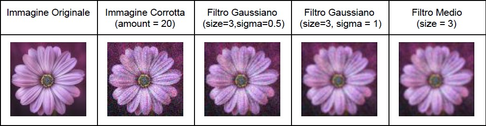

 
 
Come potete vedere, nell’immagine ricostruita (3a, 4a e 5a colonna) si sono persi i dettagli ma il rumore è decisamente minore. Inoltre notate come il filtro gaussiano preservi i dettagli rispetto al filtro medio. Potete ottenere questa figura se implementate correttamente i metodi di corruption e filtraggio gaussiano e average. 
 
Problema 4: Una volta calcolata la convoluzione i valori hanno un range diverso da [0,255]! 
Come potete vedere nella figura 1, i valori risultanti dalla convoluzione non sono in [0,255]. Prima di convertire la ip_mat in un’immagine bisogna convertire i valori del campo data nel range di cui sopra. Pertanto dobbiamo “normalizzare” la nostra ip_mat. 
 
Dovete implementare due metodi (vedete il dettaglio nel file ip_lib.h ): 
<pre>void rescale(ip_mat * mat, float new_max);</pre>
<pre>void clamp(ip_mat * mat, float low, float high);</pre> 
 
Il metodo di rescale porta i valori della variabile mat in [0,1], dovranno quindi essere moltiplicati per 255 ( new_max = 255) in modo da essere nel range [0,255] e successivamente salvati. 
 
Il metodo clamp vincola l’intervallo di valori tra un valore minimo e uno massimo. 
 

## Consegna del progetto
Trovate nello zip i seguenti file: 
<ul>
<li>ip_lib.h: l’intestazione dei metodi da implementare</li>
<li>ip_lib.c: il file che dovrete consegnare con alcuni metodi implementati</li>
<li>bmp.c e bmp.h: la libreria per leggere e scrivere bitmap</li>
<li>test_bmp.c: tester per la libreria bmp</li>
<li>main_iplib.c: main file con cui poter giocare con la libreria ip_lib</li>
<li>le immagini di questo documento con cui fare delle prove.</li>
<li>runner_gauss.sh e runner_noise.sh che genereranno dei set di immagini sfocate con filtro gaussiano e corrotte con rumore</li>
</ul> 
 
Il file “main_iplib.c” contiene il main per elaborare le immagini con le chiamate ai vari metodi di cui sopra (ovviamente senza implementazione). Potete utilizzarlo per fare dei test con i filtri/metodi che avete implementato e vedere subito i risultati. Inoltre “main_iplib.c” se lanciato senza parametri mostra una miniguida per i parametri, nel caso ci siano dubbi contattateci. 
 
Il software dovrà funzionare indipendentemente dalle immagini che vi vengono fornite, quindi vi esorto a provarlo con immagini BITMAP a piacere. Per convertire immagini in formato bitmap potete utilizzare GIMP o altro software per l’editing di immagini. 
 

La consegna è fissata al 31 Maggio 23:59 su Moodle.
 
 
Dovrete implementare correttamente tutti i metodi presenti nel file ip_lib.h e consegnare il file ip_lib.c e il makefile dentro uno zip dal nome <id_gruppo>.zip (id_gruppo lo prendete da qui). Potete inoltre aggiungere un report in pdf dove spiegate eventuali scelte implementative. 
 
Il codice va compilato con i seguenti parametri GCC (non devono essere presenti warning ed errori): 
<pre>-Wall --ansi --pedantic -lm -g3 -O3 -fsanitize=address -fsanitize=undefined -std=gnu89 -Wextra</pre> 
 
Suggerimenti: 
<ul>
<li>iniziate ad implementare i metodi di gestione della memoria (vedi controllo memoria alla fine di questo documento). Potete creare delle ip_mat con numeri casuali per iniziare a vedere che le allocazioni e de-allocazioni funzionino correttamente liberando bene la memoria (usate il tool valgrind, maggiori dettagli alla fine del documento).</li>
<li>successivamente implementate quelli relativi ad operazioni matematiche (add, sub, mul…)</li>
<li>poi passate alle operazioni semplici sulle immagini (scala di grigi, blending, brighten, etc...)</li>
<li>successivamente lavorate sulla convoluzione e sui filtri</li>
</ul> 
 
Valutazione: 
<ul>
<li>Parte 1: Implementazione gestione memoria e operazioni matematiche: 30%</li>
<li>Parte 2: Implementazione delle funzioni semplici (scala di grigi, blending, brighten,
corruption): 30%</li>
<li>Parte 3: Implementazione della convoluzione e dei filtri: il 45% del progetto
<ul>
<li>Progetti con punteggio superiore al 100% potranno ottenere la lode.</li>
</ul>
</li>
<li>Oltre alla correttezza dei metodi particolare attenzione sarà prestata alla gestione della memoria (vedi controllo memoria alla fine di questo documento).</li>
<li>Il lavoro in gruppo è molto consigliato in quanto potete dividervi agilmente i compiti una volta coordinati con le strutture dati. ATTENZIONE: la discussione verterà individualmente su TUTTO il progetto.</li>
</ul> 
 
Plagio: 
Il plagio non è tollerato pertanto tutti i progetti coinvolti saranno annullati. 
 
Controllo della memoria: 
Questo progetto utilizza in modo estremamente intensivo la memoria, sono infatti presenti molte allocazioni in quanto quasi ogni metodo restituisce in output un puntatore ad una nuova variabile, questa scelta è stata intenzionale per mettervi alla prova. 
 
Pertanto è necessario allocare e deallocare correttamente le strutture dati (ad ogni malloc abbiamo un free). Per controllare che la memoria sia gestita correttamente vi suggerisco di utilizzare il tool valgrind (lo useremo anche noi per la valutazione): 
http://valgrind.org/docs/manual/quick-start.html#quick-start.prepare 
 
Se lavorate con la macchina virtuale, questa ne è sprovvista Dovete quindi installarlo con questi due comandi (password: labprog): 
<pre>sudo dpkg --configure -a</pre>
<pre>sudo apt install valgrind</pre> 
 
Per utilizzare valgrind e fare il check della memoria dovete compilare il vostro codice con le opzioni 
<pre>-Wall -lm -g -O1</pre>
 
e lanciare il comando: 
<pre>valgrind -v --leak-check=full ./eseguibile lista_parametri</pre>

L’esecuzione del vostro codice sarà dalle 20 alle 30 volte più lenta e una volta controllato che non ci siano perdite di memoria potete ricompilare normalmente con i parametri per GCC indicati nella precedente sezione. 
 
Valgrind vi mostrerà a terminale un report con un insieme di errori relativi alla gestione della memoria, per capirli potete documentarvi qua: 
http://valgrind.org/docs/manual/mc-manual.html#mc-manual.errormsgs 
 
In generale, se ottenete questo output, avete gestito correttamente la memoria :) 
==29742== All heap blocks were freed -- no leaks are possible 
==29742== 
==29742== ERROR SUMMARY: 0 errors from 0 contexts (suppressed: 0 from 0) 
==29742== ERROR SUMMARY: 0 errors from 0 contexts (suppressed: 0 from 0) 
 
 
Buon lavoro! 
 
 

ADVERTISE: se ti può interessare una tesi su questi argomenti contattami
 

sebastiano.vascon@unive.it
